# API Key Security Architecture [PROPOSAL]

> **Note:** This is a proposed architecture for future implementation. The endpoints described here (e.g. token refresh, rotation) are NOT yet implemented in the current version.

This document describes the API key lifecycle management architecture for Datum Server, including the rationale for the chosen approach and detailed flow diagrams.

---

## Industry Approaches Comparison

### 1. AWS IoT Core (X.509 Certificates)

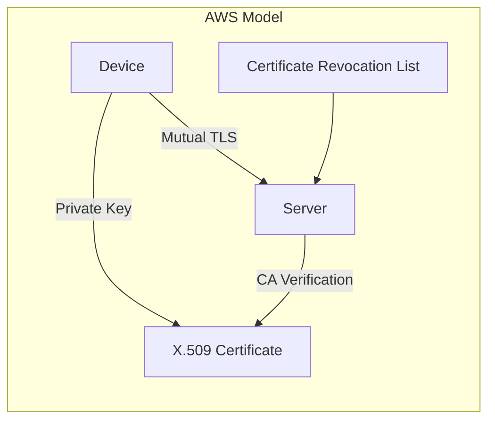

| Aspect | Rating |
|--------|--------|
| Security | ⭐⭐⭐⭐⭐ |
| Complexity | Very High |
| Device Requirements | TLS stack, certificate storage |
| Best For | Critical infrastructure, medical devices |

**Pros**: Military-grade security, mutual authentication  
**Cons**: Complex PKI infrastructure, requires certificate management, not suitable for constrained devices

---

### 2. Azure IoT Hub (SAS Tokens) ✅ RECOMMENDED

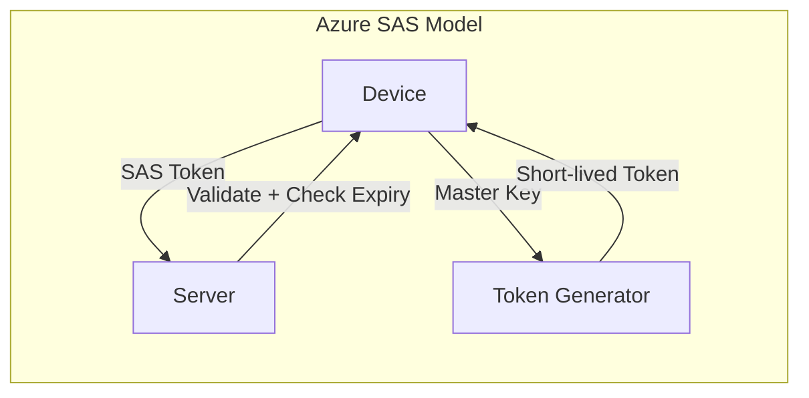

| Aspect | Rating |
|--------|--------|
| Security | ⭐⭐⭐⭐ |
| Complexity | Medium |
| Device Requirements | HMAC capability, clock sync |
| Best For | General IoT, cloud-connected devices |

**Pros**: Balance of security and practicality, industry standard, auto-renewal  
**Cons**: Requires token refresh logic in device firmware

---

### 3. Google Cloud IoT (JWT-based)

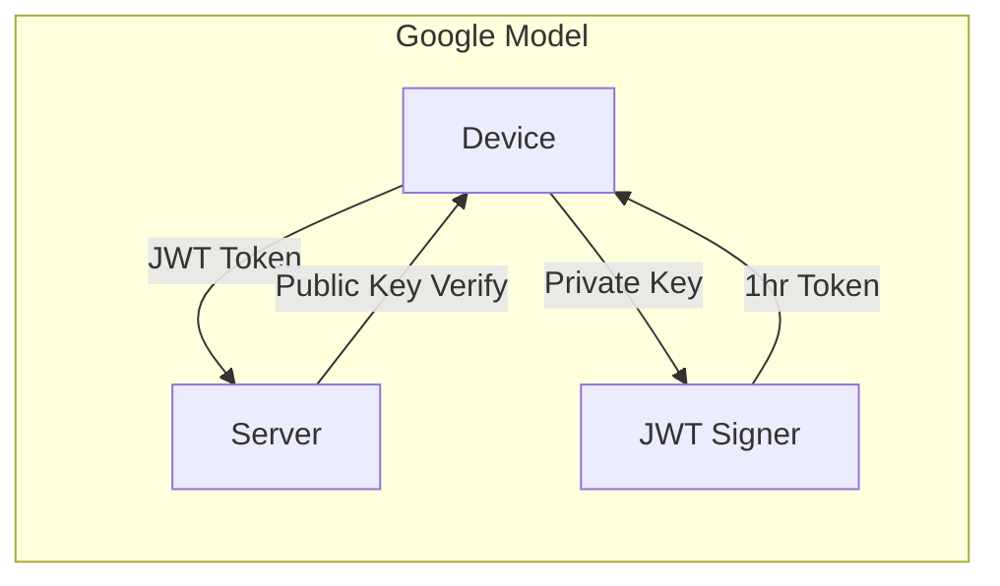

| Aspect | Rating |
|--------|--------|
| Security | ⭐⭐⭐⭐ |
| Complexity | Medium |
| Device Requirements | Asymmetric crypto, clock sync |
| Best For | Devices with crypto capabilities |

**Pros**: Stateless verification, strong cryptography  
**Cons**: Requires asymmetric crypto on device, short token lifetime

---

### 4. Simple Rotating API Keys

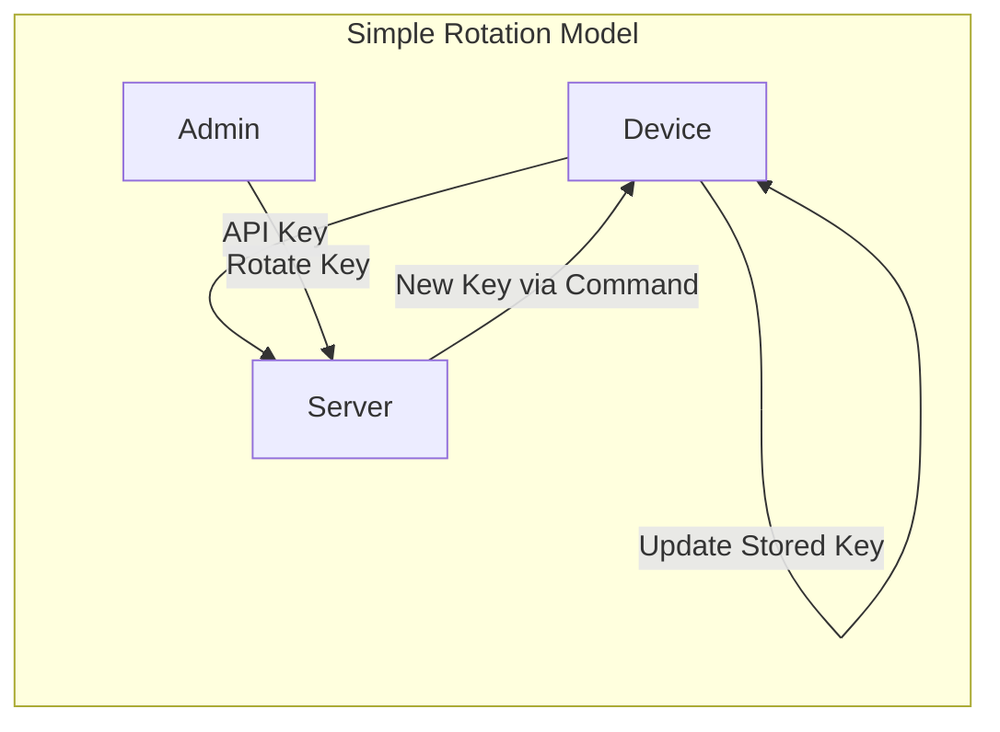

| Aspect | Rating |
|--------|--------|
| Security | ⭐⭐⭐ |
| Complexity | Low |
| Device Requirements | Minimal |
| Best For | Prototyping, simple devices, SMB |

**Pros**: Simple implementation, works with constrained devices  
**Cons**: Less secure than token-based approaches, manual rotation

---

## Recommendation: Hybrid SAS-Inspired Approach

### Why Azure SAS Model (Adapted)?

After analyzing the Datum Server architecture, I recommend a **Hybrid SAS-Inspired** approach for these reasons:

| Factor | Datum Context | Approach Fit |
|--------|---------------|--------------|
| Device Type | ESP32/Arduino (constrained) | Need simple crypto (HMAC) |
| Command Channel | Already exists (SSE/Commands) | Can deliver new keys to device |
| Admin Workflow | Mobile app + Admin API | Need manual + automatic rotation |
| Security Goal | Production-ready, not military | ⭐⭐⭐⭐ is sufficient |
| Firmware Complexity | Should remain simple | Avoid asymmetric crypto |

### Key Design Decisions

1. **Master Key + Access Token Model** (like Azure SAS)
   - Master key stored on device, never transmitted after provisioning
   - Short-lived access tokens generated from master key
   - Server validates tokens without storing them

2. **Grace Period for Rotation** (like Simple Rotation)
   - Both old and new tokens valid during transition
   - Device has time to update credentials
   - No downtime during rotation

3. **Command Channel for Key Delivery** (Datum-specific)
   - New keys delivered via existing SSE/command system
   - Device acknowledges key update
   - Admin can force rotation for compromised keys

---

## Proposed Architecture

### Data Model Changes

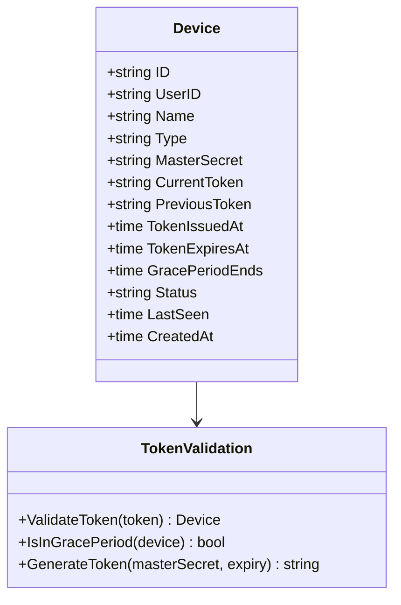

### Token Structure

```
Format: dk_{expiry_unix}.{signature}

Example: dk_1735660800.a1b2c3d4e5f67890abcd

Where:
- dk_ = Datum Key prefix
- 1735660800 = Unix timestamp (expiry)
- a1b2c3d4e5f67890abcd = HMAC-SHA256 signature (24 chars)

Note: Device ID is NOT in the token - the server validates
the signature using the stored master secret for each device.
This prevents device enumeration from captured tokens.
```

---

## Flow Diagrams

### 1. Device Provisioning (Initial Key Setup)

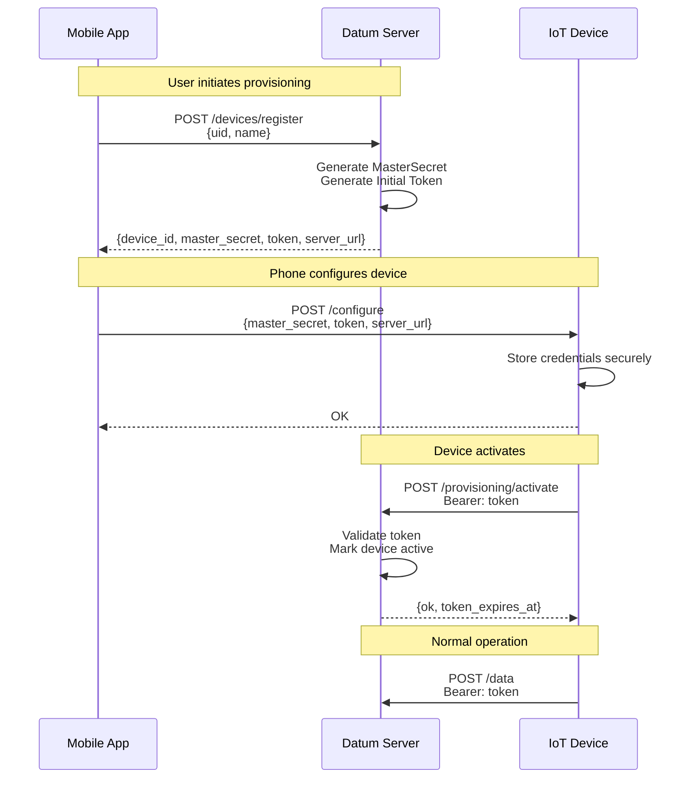

### 2. Token Self-Renewal (Automatic)

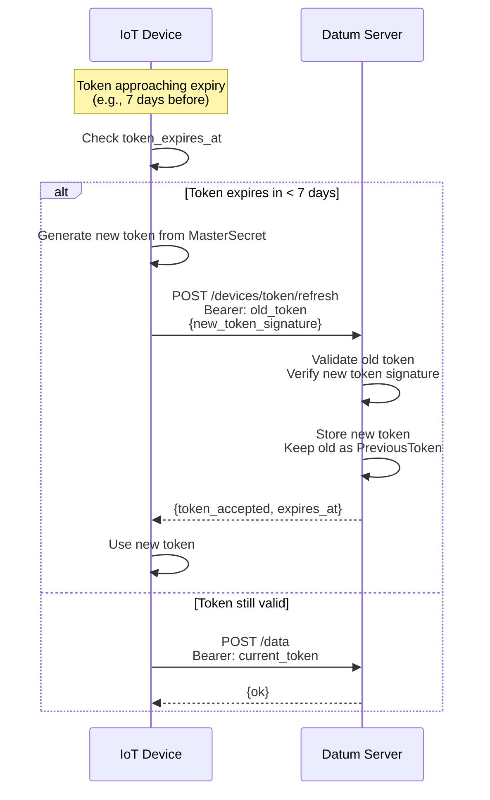

### 3. Admin-Initiated Key Rotation (Force Rotation)

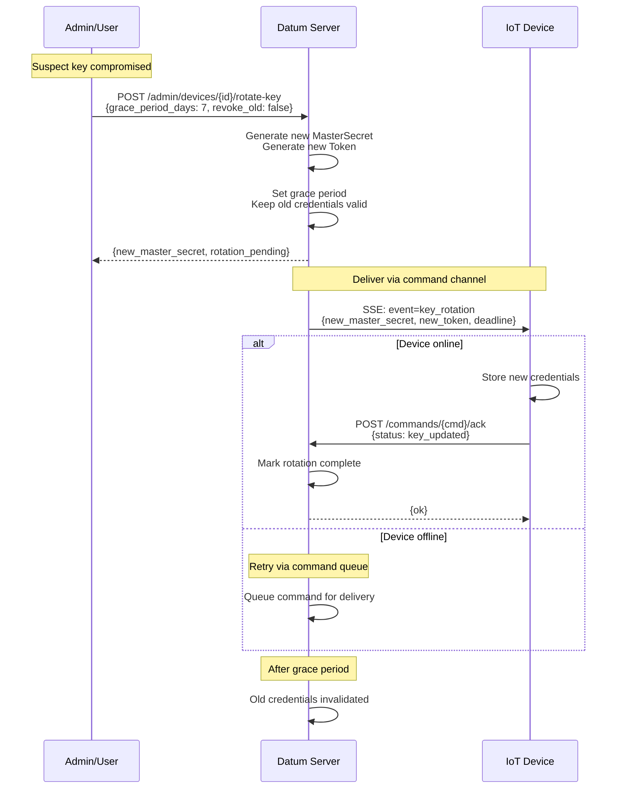

### 4. Token Validation Flow

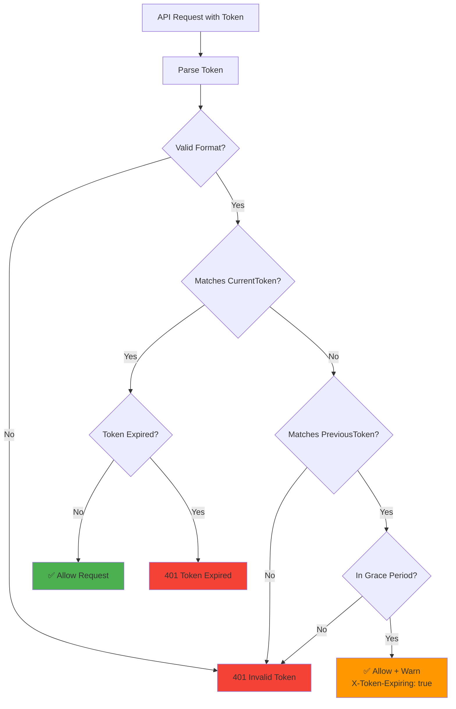

### 5. Key Revocation Flow (Emergency)

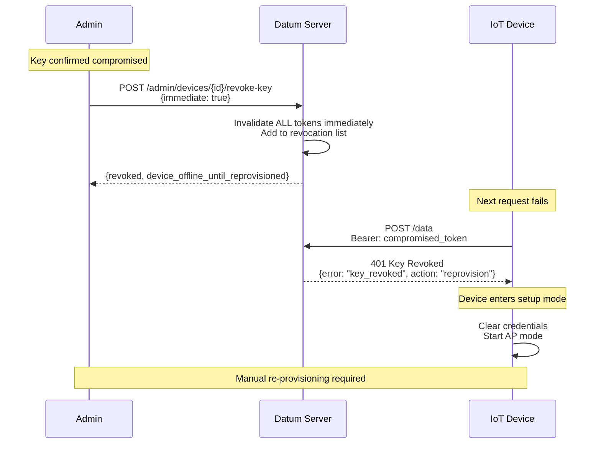

---

## State Machine: Device Key Lifecycle

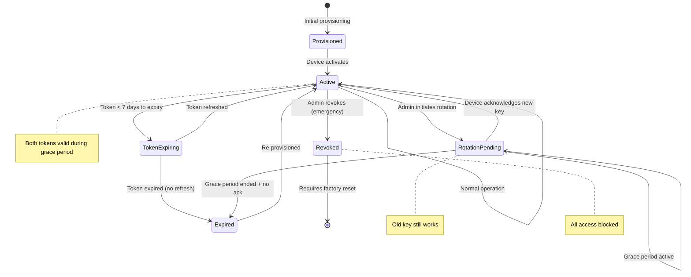

---

## Configuration Parameters

| Parameter | Default | Description |
|-----------|---------|-------------|
| `TOKEN_VALIDITY_DAYS` | 90 | How long a token is valid |
| `TOKEN_REFRESH_THRESHOLD_DAYS` | 7 | When device should refresh token |
| `GRACE_PERIOD_DAYS` | 7 | Both old and new keys valid |
| `MAX_TOKEN_REFRESH_ATTEMPTS` | 3 | Before requiring re-provisioning |

---

## Implementation Components

### Server-Side

1. **Token Generator** (`internal/auth/token.go`)
   - Generate tokens from master secret
   - Validate token signatures
   - Check expiration

2. **Key Rotation Handler** (`cmd/server/key_handlers.go`)
   - Admin rotation endpoint
   - Token refresh endpoint
   - Revocation endpoint

3. **Device Storage Updates** (`internal/storage/storage.go`)
   - New Device fields
   - Token lookup optimization

### Device-Side (Firmware)

1. **Token Manager**
   - Store master secret securely
   - Generate tokens locally
   - Auto-refresh before expiry

2. **Key Update Handler**
   - Listen for SSE key_rotation event
   - Acknowledge key update
   - Fallback to re-provisioning

---

## Security Considerations

### Advantages over Current System

| Current | Proposed |
|---------|----------|
| API key valid forever | Tokens expire (90 days default) |
| No rotation possible | Automatic + manual rotation |
| Compromised key = permanent access | Grace period + immediate revocation |
| Single credential | Master secret + rotating token |

### Attack Mitigation

| Attack | Mitigation |
|--------|------------|
| Key capture from network | Short-lived tokens limit exposure window |
| Database breach | Master secrets can be rotated fleet-wide |
| Device theft | Revoke specific device immediately |
| Brute force | Token format includes HMAC signature |

---

## Migration Plan

### Phase 1: Add New Fields (Backward Compatible)

```go
type Device struct {
    // Existing
    APIKey    string `json:"api_key"`
    
    // New (optional, for migration)
    MasterSecret   string    `json:"master_secret,omitempty"`
    CurrentToken   string    `json:"current_token,omitempty"`
    PreviousToken  string    `json:"previous_token,omitempty"`
    TokenExpiresAt time.Time `json:"token_expires_at,omitempty"`
}
```

### Phase 2: Dual Authentication

- Accept both old `APIKey` and new token system
- Existing devices continue working
- New devices use token system

### Phase 3: Migration Path

- Admin can migrate existing devices
- Generate master secret, issue first token
- Deliver via command channel

---

## Usage Examples

### CLI Commands (datumctl)

#### View Device Token Status

```bash
# Check token information for a device
datumctl device token-info my-device-001

# Output:
# 🔐 Device Token Information
# Device ID: my-device-001
# Token Status: Active
# Token Expires: 2026-03-31T00:00:00Z
# ⚠️  Token approaching expiry - refresh recommended
```

#### Rotate Device Key (Planned Rotation)

```bash
# Rotate with default 7-day grace period
datumctl device rotate-key my-device-001

# Rotate with custom grace period
datumctl device rotate-key my-device-001 --grace-days 14

# Rotate and notify device via command channel
datumctl device rotate-key my-device-001 --notify

# Output:
# 🔑 API Key Rotated Successfully
# Device ID: my-device-001
# New Token: dk_1743465600.abc123def456ghi789jkl012
# Token Expires: 2026-04-01T00:00:00Z
# Grace Period Until: 2026-01-07T00:00:00Z
# ⚠️  Old key remains valid until grace period ends
```

#### Revoke Device Key (Emergency)

```bash
# Revoke with confirmation prompt
datumctl device revoke-key my-device-001

# Revoke without confirmation (use with caution!)
datumctl device revoke-key my-device-001 --force

# Output:
# 🚨 Device Keys Revoked
# Device ID: my-device-001
# Status: All keys invalidated
# ⚠️  Device will be unable to authenticate until re-provisioned
```

### REST API Examples

#### Rotate Key via API

```bash
# Rotate device key
curl -X POST https://your-server/admin/devices/my-device-001/rotate-key \
  -H "Authorization: Bearer $JWT_TOKEN" \
  -H "Content-Type: application/json" \
  -d '{
    "grace_period_days": 7,
    "notify_device": true
  }'

# Response:
{
  "new_token": "dk_1743465600.abc123def456ghi789jkl012",
  "token_expires_at": "2026-04-01T00:00:00Z",
  "grace_period_end": "2026-01-07T00:00:00Z",
  "device_notified": true
}
```

#### Revoke Key via API

```bash
# Emergency revocation
curl -X POST https://your-server/admin/devices/my-device-001/revoke-key \
  -H "Authorization: Bearer $JWT_TOKEN" \
  -H "Content-Type: application/json" \
  -d '{"immediate": true}'

# Response:
{
  "revoked": true,
  "device_id": "my-device-001",
  "message": "All tokens invalidated. Device requires re-provisioning."
}
```

#### Device Token Refresh (Device-Side)

```bash
# Device refreshes its own token before expiry
curl -X POST https://your-server/devices/token/refresh \
  -H "Authorization: Bearer $CURRENT_TOKEN" \
  -H "Content-Type: application/json"

# Response:
{
  "token_accepted": true,
  "new_token": "dk_1743465600.xyz789abc012def345ghi678",
  "expires_at": "2026-04-01T00:00:00Z"
}
```

### Interactive Mode

```bash
# Launch interactive menu
datumctl interactive

# Navigate to: Devices → Token Info
# Or: Devices → Rotate Key
# Or: Devices → Revoke Key (Emergency)
```

### Firmware Example (Arduino/ESP32)

```cpp
#include <WiFi.h>
#include <HTTPClient.h>

String currentToken = "dk_1735660800.abc123...";
unsigned long tokenExpiry = 1735660800;

void checkAndRefreshToken() {
    unsigned long now = time(NULL);
    unsigned long daysToExpiry = (tokenExpiry - now) / 86400;
    
    if (daysToExpiry < 7) {
        // Token approaching expiry, refresh it
        Serial.println("Token expiring soon, refreshing...");
        
        HTTPClient http;
        http.begin(serverURL + "/devices/token/refresh");
        http.addHeader("Authorization", "Bearer " + currentToken);
        http.addHeader("Content-Type", "application/json");
        
        int httpCode = http.POST("{}");
        if (httpCode == 200) {
            // Parse response and update token
            // currentToken = newToken from response
            // tokenExpiry = new expiry from response
            Serial.println("Token refreshed successfully");
        }
        http.end();
    }
}

void handleKeyRotationCommand(String newToken, String newExpiry) {
    // Called when receiving key_rotation command via SSE or polling
    currentToken = newToken;
    tokenExpiry = parseExpiry(newExpiry);
    
    // Acknowledge the command
    acknowledgeCommand("key_rotation", "success");
    
    // Persist to flash/EEPROM
    saveCredentials();
}
```

---

## Backward Compatibility

The token system is **fully backward compatible**:

| Device Type | Authentication | Notes |
|-------------|----------------|-------|
| Legacy devices | `APIKey` field | Continue working unchanged |
| New devices | Token system | Use master secret + token |
| Mixed fleet | Both accepted | Middleware checks both |

Existing devices using the old `APIKey` authentication will continue to work. 
The system checks for token authentication first, then falls back to legacy API key.

---

## Related Documentation

- [Security Audit](../SECURITY_AUDIT.md)
- [Architecture Overview](./ARCHITECTURE.md)
- [WiFi Provisioning](../guides/WIFI_PROVISIONING.md)
- [Command Feature](../COMMAND_FEATURE.md)

