# Architecture Diagrams

This document contains visual representations of the Datum IoT Platform architecture, data flows, and component interactions.

## System Architecture Overview

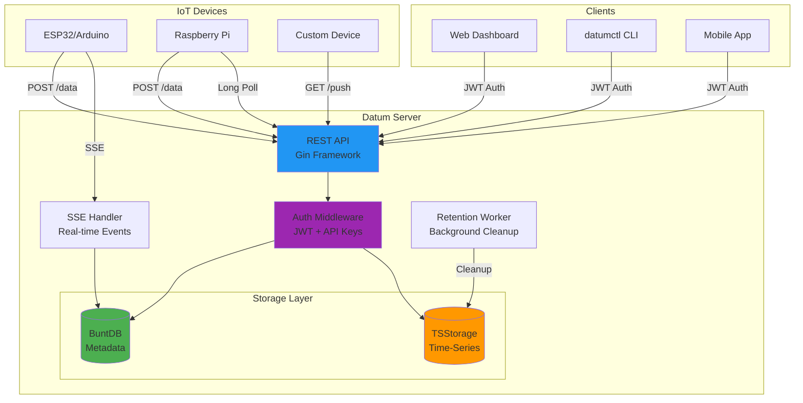

## Data Flow: Device to Storage

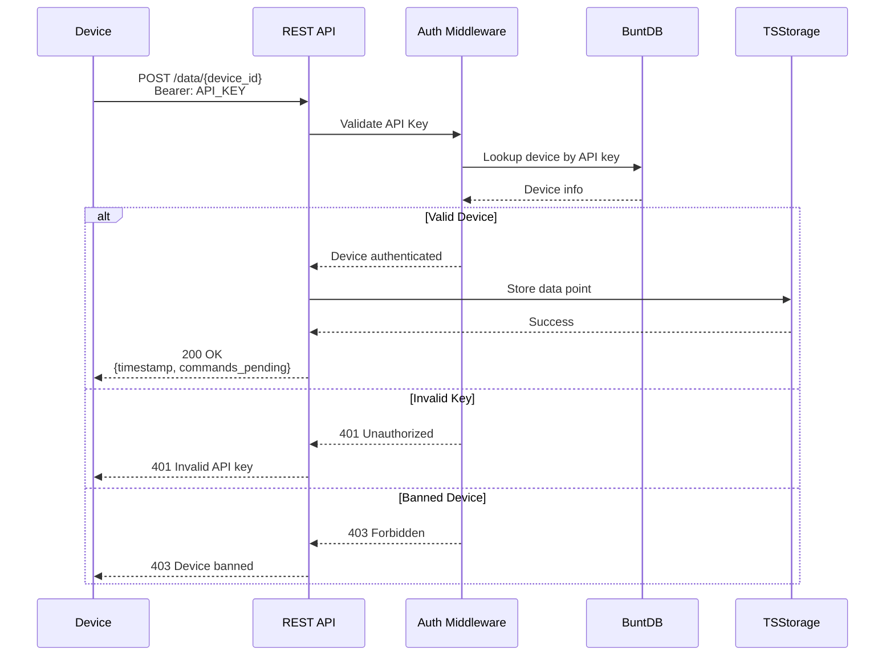

## Data Flow: User Authentication

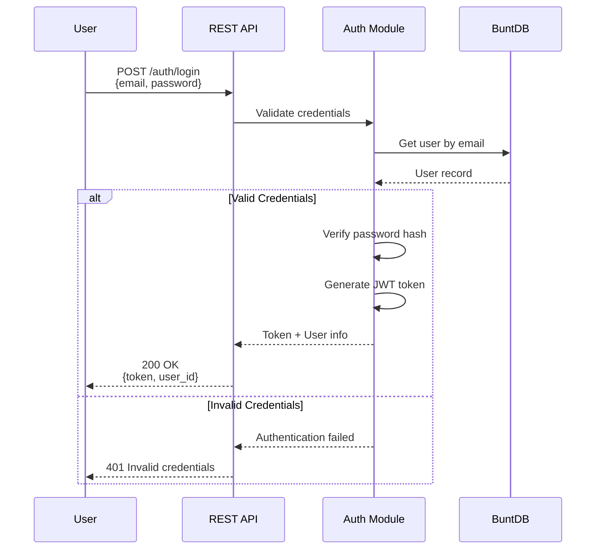

## Storage Architecture

```mermaid
graph LR
    subgraph "BuntDB (Metadata)"
        U[Users<br/>user:&#123;id&#125;]
        D[Devices<br/>device:&#123;id&#125;]
        AK[API Keys<br/>apikey:&#123;key&#125;]
        SYS[System Config<br/>system:*]
        CMD[Commands<br/>command:&#123;id&#125;]
    end
    
    subgraph "TSStorage (Time-Series)"
        P1[Partition<br/>2024-01-01_00]
        P2[Partition<br/>2024-01-01_01]
        P3[Partition<br/>2024-01-01_02]
        PN[Partition<br/>...]
    end
    
    U --> D
    D --> AK
    D -.->|device_id| P1
    D -.->|device_id| P2
    D -.->|device_id| P3
    
    style U fill:#4CAF50
    style D fill:#4CAF50
    style AK fill:#4CAF50
    style SYS fill:#4CAF50
    style CMD fill:#4CAF50
    style P1 fill:#FF9800
    style P2 fill:#FF9800
    style P3 fill:#FF9800
    style PN fill:#FF9800
```

## Command Flow: SSE Real-time Commands

```mermaid
sequenceDiagram
    participant Admin as Admin/User
    participant API as REST API
    participant BuntDB
    participant SSE as SSE Handler
    participant Device
    
    Note over Device,SSE: Device maintains SSE connection
    Device->>SSE: GET /device/{id}/commands/stream
    SSE-->>Device: SSE Connection Open
    
    Admin->>API: POST /devices/{id}/commands<br/>{action: "reboot"}
    API->>BuntDB: Store command
    BuntDB-->>API: Command ID
    API-->>Admin: 201 Command queued
    
    Note over SSE,Device: Command delivered in real-time
    SSE->>Device: event: command<br/>data: {id, action: "reboot"}
    
    Device->>API: POST /device/&#123;id&#125;/commands/&#123;cmd_id&#125;/ack<br/>{status: "success"}
    API->>BuntDB: Update command status
    API-->>Device: 200 OK
```

## Rate Limiting Flow

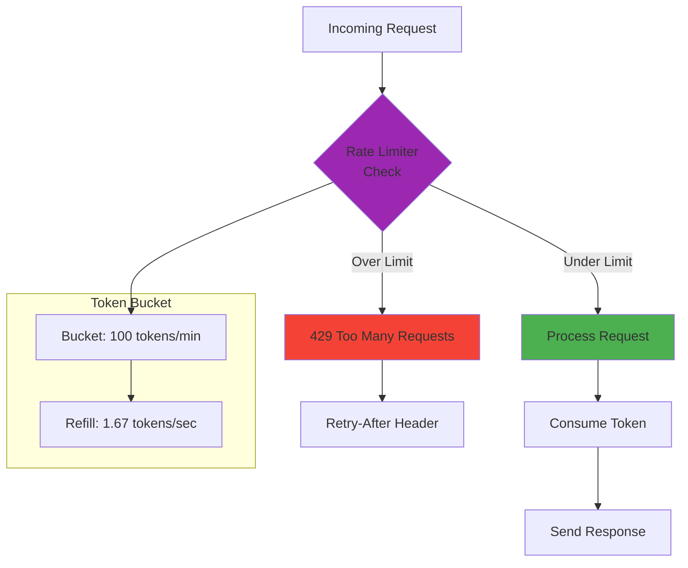

## Deployment Architecture

### Single Server Deployment

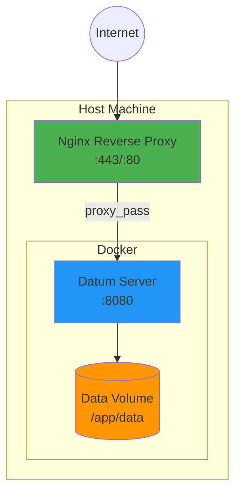

### High Availability Deployment

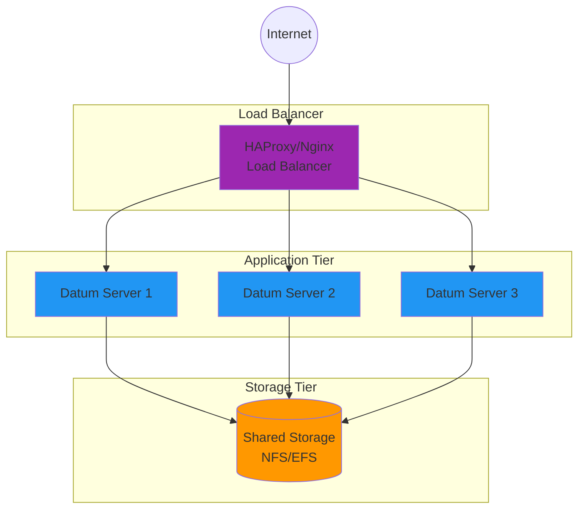

## Data Retention Flow

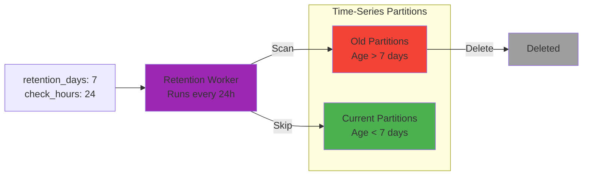

## API Endpoint Organization

```mermaid
graph TD
    API["/api"] --> AUTH["/auth"]
    API --> DEVICES["/devices"]
    API --> DATA["/data"]
    API --> DEVICE["/device"]
    API --> PUBLIC["/public"]
    API --> ADMIN["/admin"]
    API --> SYSTEM["/system"]
    
    AUTH --> REGISTER[POST /register]
    AUTH --> LOGIN[POST /login]
    
    DEVICES --> CREATE_DEV[POST /]
    DEVICES --> LIST_DEV[GET /]
    DEVICES --> DELETE_DEV[DELETE /&#123;id&#125;]

    DATA --> POST_DATA[POST /&#123;id&#125;]
    DATA --> GET_LATEST[GET /&#123;id&#125;]
    DATA --> GET_HISTORY[GET /&#123;id&#125;/history]
    
    DEVICE --> COMMANDS["/commands"]
    DEVICE --> PUSH["GET /&#123;id&#125;/push"]
    
    COMMANDS --> POLL[GET /poll]
    COMMANDS --> STREAM[GET /stream]
    COMMANDS --> ACK[POST /&#123;cmd_id&#125;/ack]
    
    ADMIN --> USERS[/users]
    ADMIN --> DEVICES_ADMIN[/devices]
    ADMIN --> DATABASE[/database]
    
    style API fill:#2196F3
    style AUTH fill:#9C27B0
    style ADMIN fill:#f44336
    style PUBLIC fill:#4CAF50
```

## Device Lifecycle

```mermaid
stateDiagram-v2
    [*] --> Created: POST /devices
    Created --> Active: First data sent
    Active --> Active: Sending data
    Active --> Suspended: Admin suspends
    Active --> Banned: Rate limit exceeded
    Suspended --> Active: Admin reactivates
    Banned --> Active: Admin unbans
    Active --> Deleted: DELETE /devices/&#123;id&#125;
    Suspended --> Deleted: Admin deletes
    Deleted --> [*]
    
    note right of Active: Normal operation
    note right of Banned: Temporary block
    note right of Suspended: Admin action
```

## User Authentication States

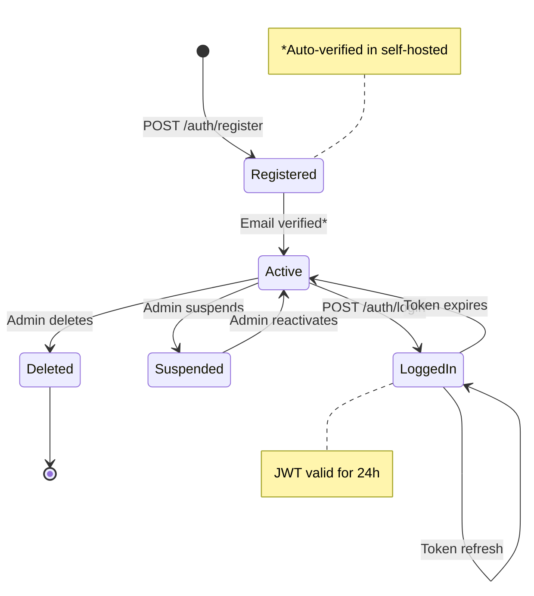

## WiFi AP Provisioning Flow

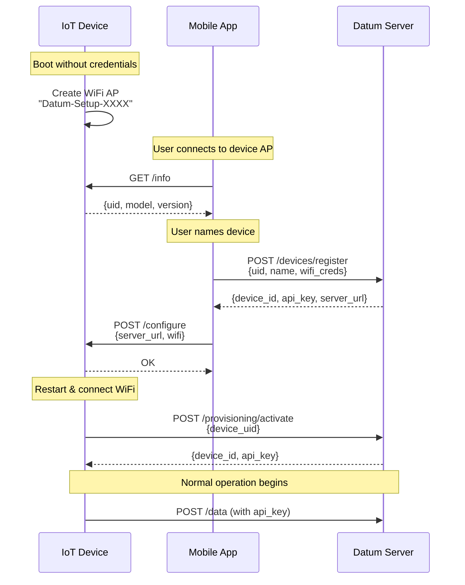

## Provisioning State Machine

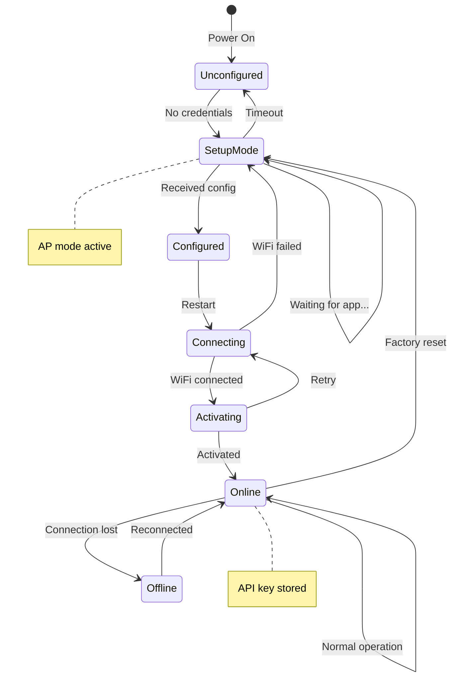

---

## Viewing Diagrams

These diagrams use [Mermaid](https://mermaid.js.org/) syntax. To view them:

1. **GitHub**: Renders automatically in README files
2. **VS Code**: Install "Markdown Preview Mermaid Support" extension
3. **Online**: Use [Mermaid Live Editor](https://mermaid.live/)
4. **Documentation Sites**: Most static site generators support Mermaid

## Related Documentation

- [Storage Architecture](../reference/STORAGE.md)
- [API Reference](../reference/API.md)
- [Deployment Guide](../guides/DEPLOYMENT.md)
- [Security Guide](../guides/SECURITY.md)
- [WiFi Provisioning Guide](../guides/WIFI_PROVISIONING.md)
