# Architecture Diagrams

This document contains visual representations of the Datum IoT Platform architecture, data flows, and component interactions.

## System Architecture Overview

```mermaid
graph TB
    subgraph "IoT Devices"
        D1[ESP32/Arduino]
        D2[Raspberry Pi]
        D3[Custom Device]
    end

    subgraph "Datum Server"
        API[REST API<br/>Gin Framework]
        MQTT[MQTT Broker<br/>Mochi-MQTT]
        SSE[SSE Handler<br/>Legacy/Web]
        AUTH[Auth Middleware<br/>JWT + API Keys]
        
        subgraph "Storage Layer"
            DB[(PostgreSQL/BuntDB<br/>Metadata)]
            TS[(TSStorage<br/>Time-Series)]
        end
        
        RET[Retention Worker<br/>Background Cleanup]
    end

    subgraph "Clients"
        WEB[Web Dashboard]
        CLI[datumctl CLI]
        APP[Mobile App]
    end

    D1 -->|POST /dev/{id}/data| API
    D1 -->|MQTT dev/{id}/data| MQTT
    D2 -->|POST /dev/{id}/data| API
    D3 -->|POST /dev/{id}/data| API
    
    D1 -.->|Sub: dev/{id}/conf| MQTT
    D1 -->|GET /dev/{id}| API
    
    API --> AUTH
    MQTT --> AUTH
    AUTH --> DB
    AUTH --> TS
    
    MQTT --> TS
    
    RET -->|Cleanup| TS
    
    WEB -->|JWT Auth| API
    WEB -.->|Sub: dev/{id}/data| MQTT
    CLI -->|JWT Auth| API
    APP -->|JWT Auth| API
    
    style API fill:#2196F3
    style MQTT fill:#E91E63
    style DB fill:#4CAF50
    style TS fill:#FF9800
    style AUTH fill:#9C27B0
```

## Data Flow: Device to Storage (HTTP & MQTT)

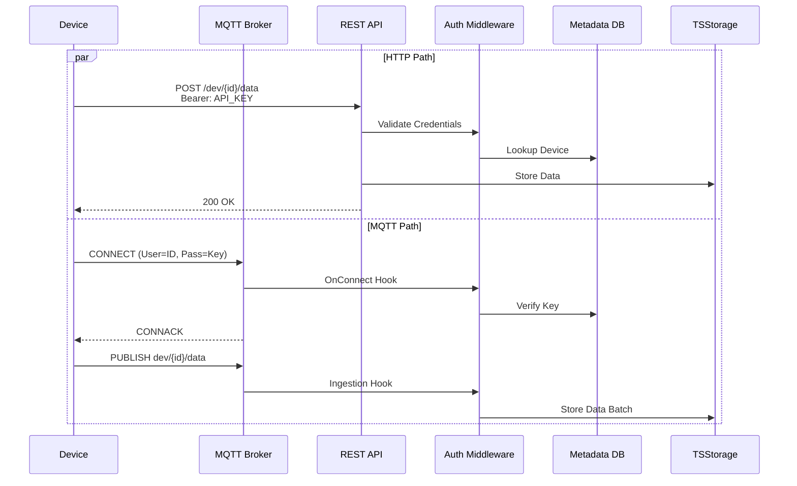

## Data Flow: User Authentication

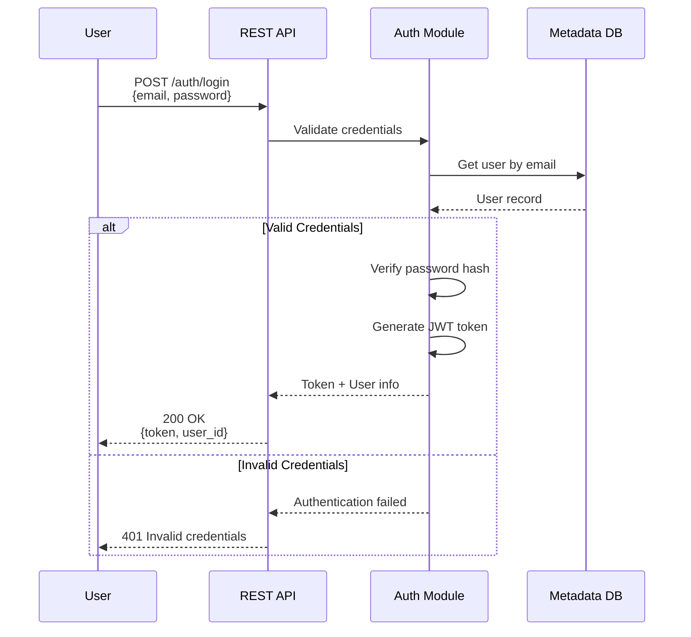

## Storage Architecture


## Remote Configuration Flow (Shadow Twin)

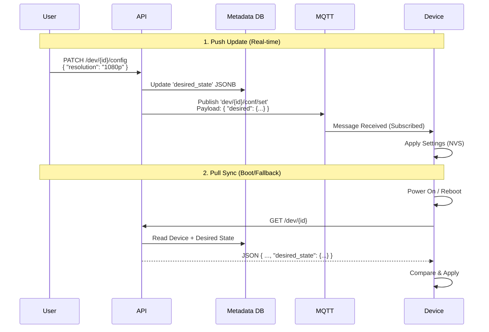

## Command Flow: SSE Real-time Commands

```mermaid
sequenceDiagram
    participant Admin as Admin/User
    participant API as REST API
    participant BuntDB
    participant SSE as SSE Handler
    participant Device
    
    Note over Device,SSE: Device maintains SSE connection
    Device->>SSE: GET /dev/{id}/cmd/stream
    SSE-->>Device: SSE Connection Open
    
    Admin->>API: POST /dev/{id}/cmd<br/>{action: "reboot"}
    API->>BuntDB: Store command
    BuntDB-->>API: Command ID
    API-->>Admin: 201 Command queued
    
    Note over SSE,Device: Command delivered in real-time
    SSE->>Device: event: command<br/>data: {id, action: "reboot"}
    
    Device->>API: POST /dev/&#123;id&#125;/cmd/&#123;cmd_id&#125;/ack<br/>{status: "success"}
    API->>BuntDB: Update command status
    API-->>Device: 200 OK
```

## Rate Limiting Flow

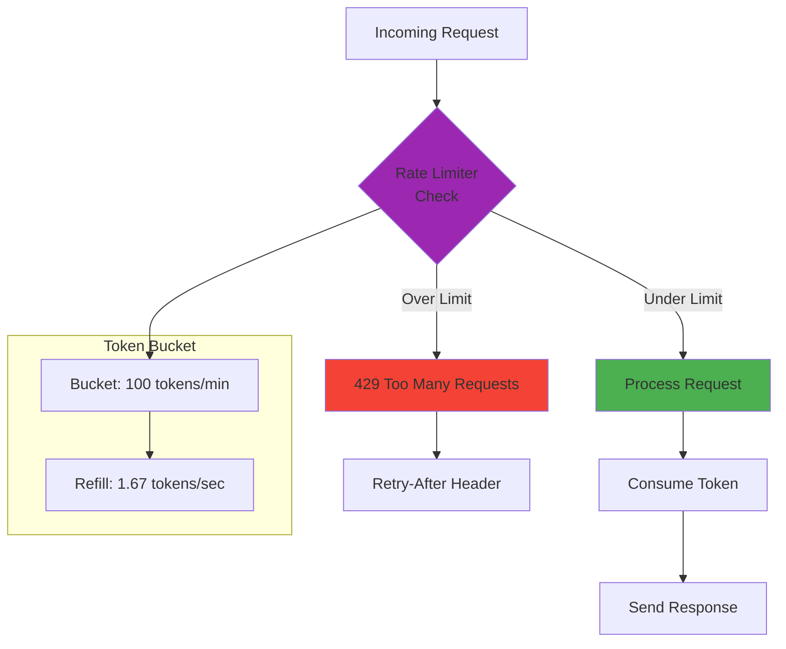

## Deployment Architecture

### Single Server Deployment

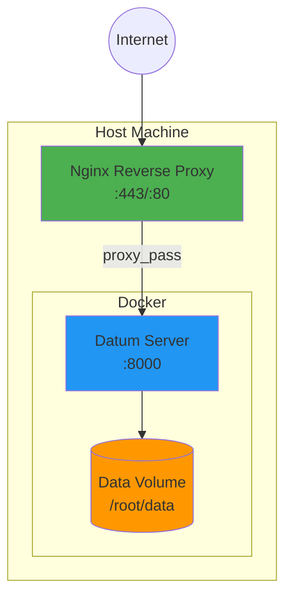

### High Availability Deployment

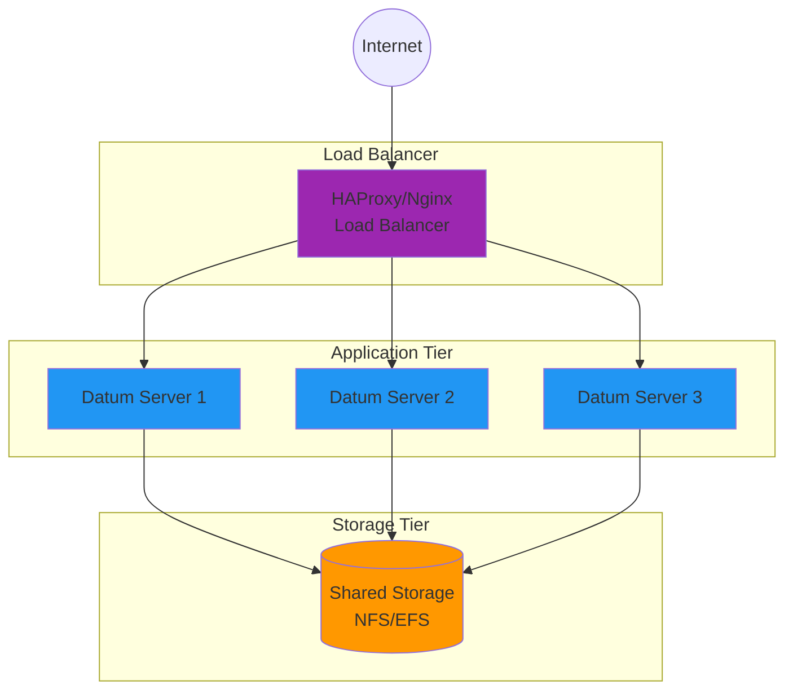

## Data Retention Flow

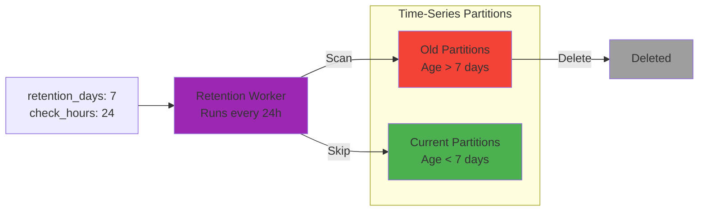

## API Endpoint Organization

```mermaid
graph TD
    API["/api"] --> AUTH["/auth"]
    API --> DEV["/dev"]
    API --> ADMIN["/admin"]
    API --> SYS["/sys"]
    
    AUTH --> REGISTER[POST /register]
    AUTH --> LOGIN[POST /login]
    
    DEV --> CREATE_DEV[POST /]
    DEV --> LIST_DEV[GET /]
    
    DEV --> DEVICE["/&#123;id&#125;"]
    DEVICE --> DATA["/data"]
    DEVICE --> CMD["/cmd"]
    
    DATA --> POST_DATA[POST /]
    DATA --> GET_HIST[GET /history]
    
    CMD --> LIST_CMD[GET /]
    CMD --> SEND_CMD[POST /]
    CMD --> STREAM[GET /stream]
    CMD --> ACK[POST /&#123;cmd_id&#125;/ack]
    
    ADMIN --> USERS["/users"]
    ADMIN --> DEVICES_ADMIN["/dev"]
    ADMIN --> DATABASE["/database"]
    
    style API fill:#2196F3
    style AUTH fill:#9C27B0
    style ADMIN fill:#f44336
    style DEV fill:#4CAF50
```

## Device Lifecycle

```mermaid
stateDiagram-v2
    [*] --> Created: POST /dev
    Created --> Active: First data sent
    Active --> Active: Sending data
    Active --> Suspended: Admin suspends
    Active --> Banned: Rate limit exceeded
    Suspended --> Active: Admin reactivates
    Banned --> Active: Admin unbans
    Active --> Deleted: DELETE /dev/&#123;id&#125;
    Suspended --> Deleted: Admin deletes
    Deleted --> [*]
    
    note right of Active: Normal operation
    note right of Banned: Temporary block
    note right of Suspended: Admin action
```

## User Authentication States

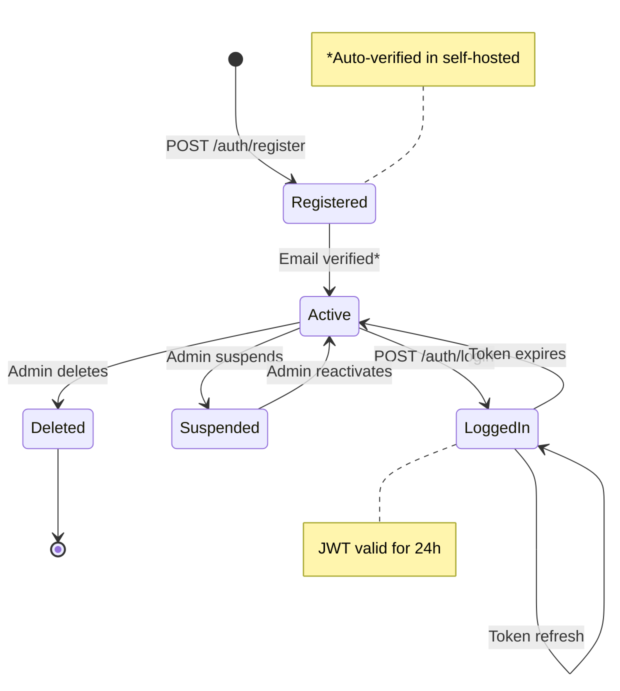

## WiFi AP Provisioning Flow

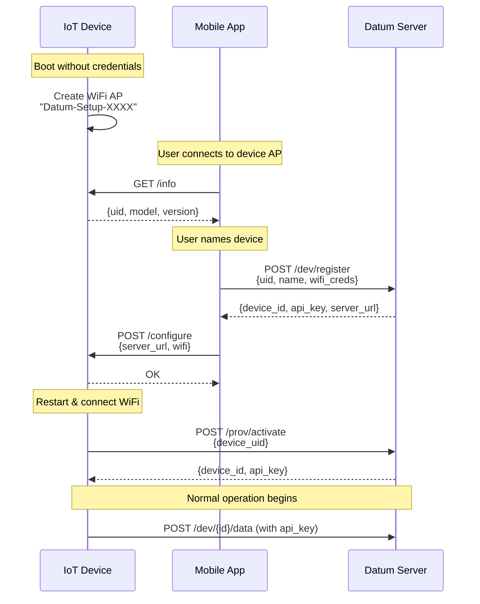

## Provisioning State Machine

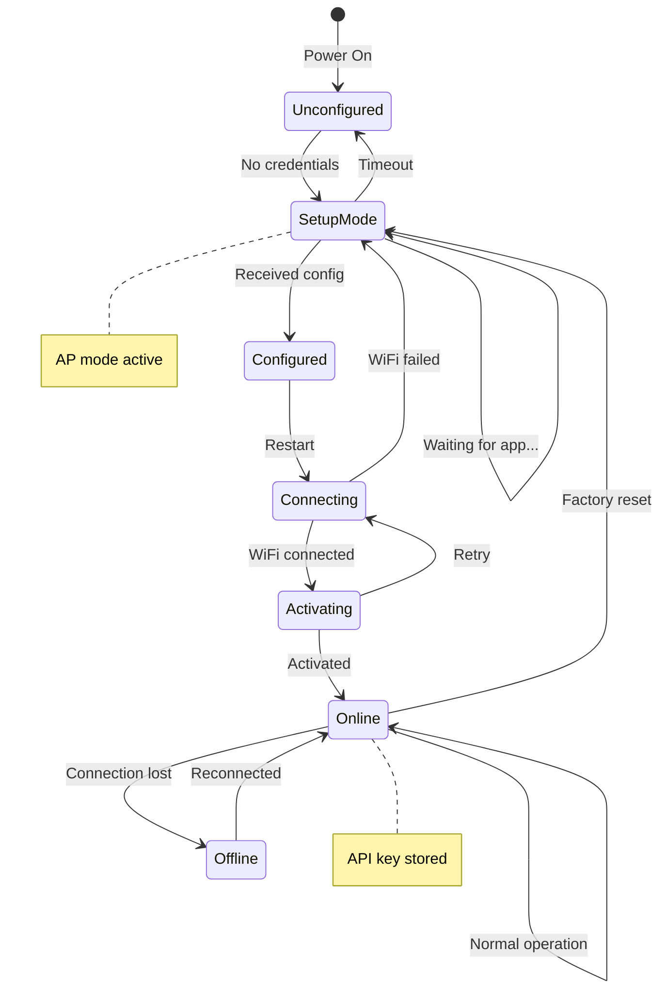

---

## Viewing Diagrams

These diagrams use [Mermaid](https://mermaid.js.org/) syntax. To view them:

1. **GitHub**: Renders automatically in README files
2. **VS Code**: Install "Markdown Preview Mermaid Support" extension
3. **Online**: Use [Mermaid Live Editor](https://mermaid.live/)
4. **Documentation Sites**: Most static site generators support Mermaid

## Related Documentation

- [Storage Architecture](../reference/STORAGE.md)
- [API Reference](../reference/API.md)
- [Deployment Guide](../guides/DEPLOYMENT.md)
- [Security Guide](../guides/SECURITY.md)
- [WiFi Provisioning Guide](../guides/WIFI_PROVISIONING.md)
