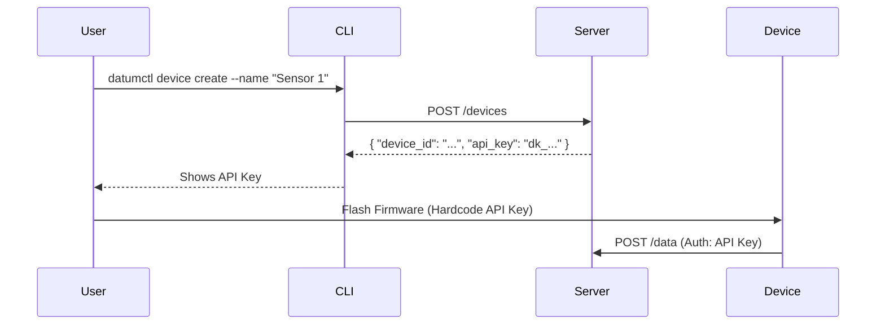
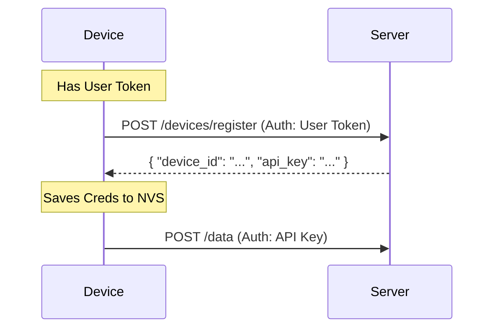
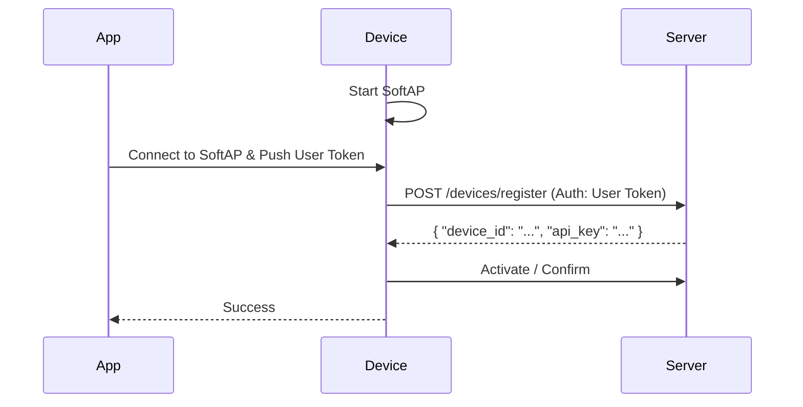

# System Setup & Registration Guide

## Initial System Setup (First Time)

When you first start the Datum server, you need to initialize it. There are **3 easy ways** to do this:

### Method 1: Interactive CLI (Recommended) ⭐

```bash
./datumctl setup
```

This will:
- Prompt you for platform name, admin email, and password
- Show you a summary before proceeding
- Create the admin user
- **Automatically log you in**
- Save your credentials

**Example:**
```bash
$ ./datumctl setup

🎯 Datum Server - Initial Setup
━━━━━━━━━━━━━━━━━━━━━━━━━━━━━━━━━━━━━━━━━

? Platform name: My IoT Platform
? Admin email: admin@example.com
Admin password (min 8 chars): ********

📋 Setup Summary:
  Platform: My IoT Platform
  Admin Email: admin@example.com
  Allow Registration: false
  Data Retention: 30 days

? Proceed with setup? Yes

✅ System initialized successfully!
━━━━━━━━━━━━━━━━━━━━━━━━━━━━━━━━━━━━━━━━━

👤 Admin User Created
  Email: admin@example.com
  Role: admin

✅ Token saved to ~/.datumctl.yaml
You are now logged in!
```

### Method 2: CLI with Flags (Quick)

```bash
./datumctl setup \
  --email admin@example.com \
  --platform "My IoT Platform" \
  --retention 30
```

This will prompt only for password and then setup everything.

### Method 3: Direct API Call (curl)

```bash
curl -X POST http://localhost:8000/system/setup \
  -H "Content-Type: application/json" \
  -d '{
    "platform_name": "My IoT Platform",
    "admin_email": "admin@example.com",
    "admin_password": "YourSecurePassword123",
    "allow_register": false,
    "data_retention": 30
  }'
```

**Response:**
```json
{
  "message": "System initialized successfully",
  "user_id": "abc123...",
  "email": "admin@example.com",
  "role": "admin",
  "token": "eyJhbGc...",
  "platform": "My IoT Platform"
}
```

## User Registration (After Setup)

### Option 1: Admin Creates Users

Admin can create user accounts using CLI:

```bash
# Login as admin first
./datumctl login --email admin@example.com

# Create new user
./datumctl admin create-user
```

Or using API:
```bash
curl -X POST http://localhost:8080/admin/users \
  -H "Authorization: Bearer YOUR_ADMIN_TOKEN" \
  -H "Content-Type: application/json" \
  -d '{
    "email": "user@example.com",
    "password": "SecurePassword123",
    "role": "user"
  }'
```

### Option 2: Self Registration (If Enabled)

If you enabled `allow_register` during setup:

```bash
curl -X POST http://localhost:8080/auth/register \
  -H "Content-Type: application/json" \
  -d '{
    "email": "newuser@example.com",
    "password": "SecurePassword123"
  }'
```

**Note**: Self-registration is **disabled by default** for security.

### Option 3: Enable Registration Later

Admin can enable/disable registration via system config:

```bash
curl -X PUT http://localhost:8080/admin/config \
  -H "Authorization: Bearer ADMIN_TOKEN" \
  -H "Content-Type: application/json" \
  -d '{
    "allow_register": true
  }'
```

## Device Registration Flows

There are three ways to register a device.

### Flow 1: Manual Registration (Pre-Shared Key)
Best for prototyping or simple deployments.



### Flow 2: Self-Registration (HTTP)
Device uses a User Token to register itself on first boot.



### Flow 3: WiFi Provisioning (Mobile App)
User claims device via Mobile App, app pushes credentials.



## Device Registration (API Keys)

Devices don't use email/password. They use API keys:

```bash
# Create device (automatically generates API key)
./datumctl device create --name "Temperature Sensor"
```

**Response includes API key:**
```
✅ Device created: temp-sensor-abc123

🔑 API Key (save this - shown only once!):
   dk_0123456789abcdef

📝 Use this API key for device authentication:
   curl -X POST http://localhost:8080/data/YOUR_DEVICE_ID \
     -H "Authorization: Bearer dk_0123456789abcdef" \
     -H "Content-Type: application/json" \
     -d '{"temperature": 25.5}'
```

## Summary of Authentication Methods

| Method | Use Case | How to Get |
|--------|----------|------------|
| **Admin Account** | System management | `datumctl setup` (first time) |
| **User Account** | Regular users | Admin creates via `datumctl admin create-user` |
| **Device API Key** | IoT devices | `datumctl device create` |
| **JWT Token** | API access | `datumctl login` or POST to `/auth/login` |

## Common Questions

### Q: Can I create users without being admin?
**A:** No, only admins can create users. This is for security.

### Q: How do I allow users to self-register?
**A:** During setup, use `--allow-register` flag:
```bash
datumctl setup --allow-register
```

Or enable it later as admin:
```bash
curl -X PUT http://localhost:8080/admin/config \
  -H "Authorization: Bearer ADMIN_TOKEN" \
  -d '{"allow_register": true}'
```

### Q: I forgot my admin password, what now?
**A:** See [PASSWORD_RESET.md](PASSWORD_RESET.md) or use:
```bash
./scripts/reset-password.sh
```

### Q: Can devices register themselves?
### Q: Can devices register themselves?
**A:** Yes! Devices can use **Self-Registration** if they possess a valid **User Token**. They call `POST /devices/register` to exchange the User Token for a permanent Device API Key. See [Flow 2](#flow-2-self-registration-http) above.

### Q: What's the difference between datumctl setup and login?
**A:** 
- **setup**: First-time system initialization (creates admin, initializes DB)
- **login**: Authenticate with existing credentials

## Quick Start Workflow

```bash
# 1. Start server
make run-server

# 2. Initialize system (first time only)
./datumctl setup

# 3. You're automatically logged in! Create a device
./datumctl device create --name "My Sensor"

# 4. Start sending data (use the API key from step 3)
curl -X POST http://localhost:8080/data/YOUR_DEVICE_ID \
  -H "Authorization: Bearer YOUR_DEVICE_API_KEY" \
  -d '{"temperature": 22.5, "humidity": 60}'

# 5. Query data
./datumctl data get --device YOUR_DEVICE_ID --last 1h
```

## Need Help?

- View all commands: `./datumctl --help`
- Interactive mode: `./datumctl interactive`
- Check server status: `./datumctl status`
- Documentation: See `docs/` folder
