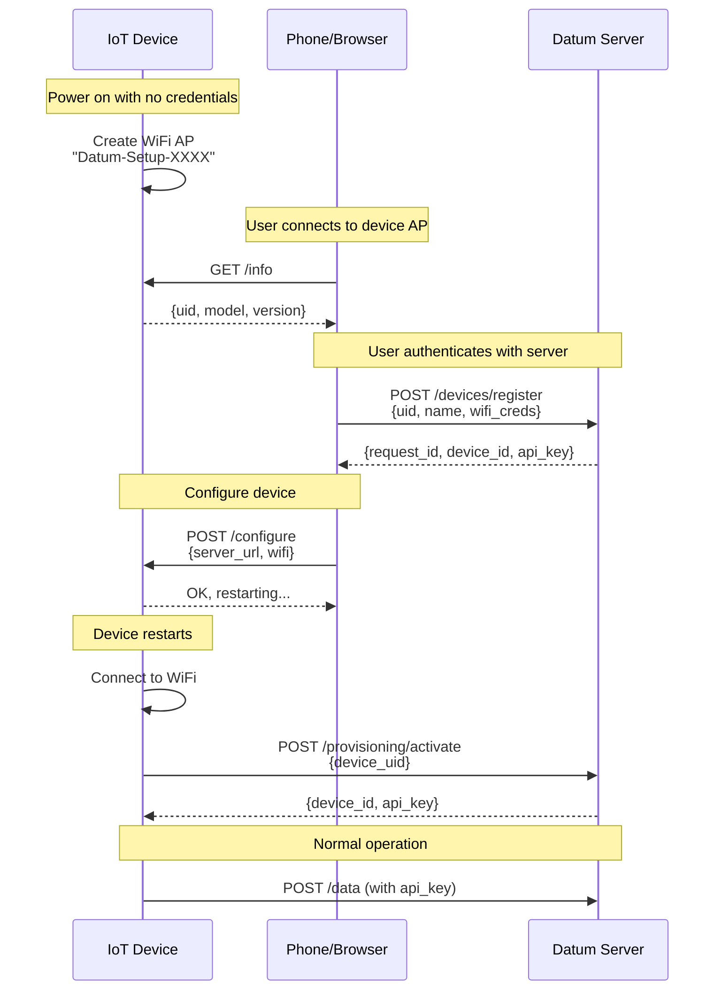

# WiFi AP Provisioning Guide

This guide explains the zero-touch device provisioning system using WiFi Access Point mode.

## Overview

The WiFi AP provisioning system allows devices to be configured without any pre-programmed credentials. Devices ship with generic firmware and are configured by end users through a mobile app or web browser.

## Key Features

- **Zero-touch manufacturing**: No secrets programmed at factory
- **User-friendly setup**: Visual web interface or mobile app
- **Secure**: API keys generated server-side, never pre-shared
- **Universal**: Works with any WiFi-capable device
- **No app required**: Can be configured via any web browser

## Architecture



## Provisioning Flow

### Phase 1: Setup Mode

When a device boots without credentials:

1. Device checks for saved WiFi credentials
2. If none found, device enters **Setup Mode**
3. Device creates WiFi Access Point: `Datum-Setup-XXXX`
4. Device starts HTTP server on `http://192.168.4.1`
5. LED blinks rapidly to indicate setup mode

### Phase 2: Device Discovery

User or mobile app discovers the device:

1. User connects to device's WiFi AP
2. Browser/app opens `http://192.168.4.1`
3. Device serves setup page showing:
   - Device UID (MAC address)
   - Model and firmware version
   - Configuration form

### Phase 3: Server Registration

Mobile app registers device with Datum server:

```bash
# Mobile app calls this endpoint
POST /devices/register
Authorization: Bearer <user_jwt_token>
Content-Type: application/json

{
    "device_uid": "AABBCCDDEEFF",
    "device_name": "Living Room Sensor",
    "device_type": "temperature_humidity",
    "wifi_ssid": "HomeWiFi",
    "wifi_pass": "password123"
}
```

Response:
```json
{
    "request_id": "prov_abc123def456",
    "device_uid": "AABBCCDDEEFF",
    "device_id": "dev_xyz789abc012",
    "api_key": "dk_0123456789abcdef",
    "server_url": "https://api.datum.io",
    "expires_at": "2025-01-15T12:30:00Z",
    "status": "pending",
    "activate_url": "https://api.datum.io/provisioning/activate"
}
```

### Phase 4: Device Configuration

Mobile app or user configures the device:

```bash
# Send to device at http://192.168.4.1
POST /configure
Content-Type: application/json

{
    "server_url": "https://api.datum.io",
    "wifi_ssid": "HomeWiFi",
    "wifi_pass": "password123"
}
```

Device saves credentials and restarts.

### Phase 5: Activation

Device connects to WiFi and activates:

```bash
# Device calls this endpoint
POST /provisioning/activate
Content-Type: application/json

{
    "device_uid": "AABBCCDDEEFF",
    "firmware_version": "1.0.0",
    "model": "datum-sensor-v1"
}
```

Response:
```json
{
    "device_id": "dev_xyz789...",
    "api_key": "dk_secret123...",
    "server_url": "https://api.datum.io",
    "message": "Device activated successfully"
}
```

### Phase 6: Normal Operation

Device uses API key for all subsequent requests:

```bash
POST /devices/dev_xyz789/push
Authorization: Bearer dk_secret123...
Content-Type: application/json

{
    "temperature": 22.5,
    "humidity": 45
}
```

## API Reference

### Mobile App Endpoints (JWT Auth Required)

#### POST /devices/register

Register a device to the current user's account.

**Request:**
```json
{
    "device_uid": "AABBCCDDEEFF",
    "device_name": "My Sensor",
    "device_type": "temperature",
    "wifi_ssid": "HomeWiFi",
    "wifi_pass": "secret"
}
```

**Response (201 Created):**
```json
{
    "request_id": "prov_...",
    "device_uid": "AABBCCDDEEFF",
    "device_id": "dev_...",
    "api_key": "dk_...",
    "server_url": "https://api.datum.io",
    "expires_at": "2024-01-15T12:30:00Z",
    "status": "pending",
    "activate_url": "https://api.datum.io/provisioning/activate"
}
```

**Error Responses:**
- `400` - Invalid request
- `401` - Unauthorized
- `409` - Device already registered

---

#### GET /devices/check-uid/:uid

Check if a device UID is already registered.

**Response:**
```json
{
    "registered": false,
    "has_pending": false
}
```

Or if registered:
```json
{
    "registered": true,
    "device_id": "dev_...",
    "has_pending": false
}
```

---

#### GET /devices/provisioning

List all provisioning requests for current user.

**Response:**
```json
{
    "requests": [
        {
            "request_id": "prov_...",
            "device_uid": "AABBCCDDEEFF",
            "device_name": "My Sensor",
            "status": "completed",
            "created_at": "2024-01-15T10:00:00Z"
        }
    ]
}
```

---

#### GET /devices/provisioning/:request_id

Get status of a specific provisioning request.

---

#### DELETE /devices/provisioning/:request_id

Cancel a pending provisioning request.

---

### Device Endpoints (No Auth)

#### POST /provisioning/activate

Called by device to complete activation.

**Request:**
```json
{
    "device_uid": "AABBCCDDEEFF",
    "firmware_version": "1.0.0",
    "model": "datum-sensor-v1"
}
```

**Response (200 OK):**
```json
{
    "device_id": "dev_...",
    "api_key": "dk_...",
    "server_url": "https://api.datum.io",
    "message": "Device activated successfully"
}
```

**Error Responses:**
- `404` - No provisioning request found
- `409` - Device already registered
- `410` - Provisioning request expired

---

#### GET /provisioning/check/:uid

Check if there's a pending provisioning request for a UID.

**Response:**
```json
{
    "status": "pending",
    "message": "Provisioning request found. Call /provisioning/activate to complete.",
    "activate_url": "https://api.datum.io/provisioning/activate",
    "expires_at": "2024-01-15T12:30:00Z"
}
```

Or if no request:
```json
{
    "status": "unconfigured",
    "message": "No provisioning request found. Register device via mobile app."
}
```

## Security Considerations

### Device UID

The Device UID is typically the MAC address or chip ID, which:
- Is unique per device
- Cannot be easily spoofed (hardware-based)
- Is visible on the device/packaging

### Provisioning Request Expiration

Requests expire after 15 minutes by default. This prevents:
- Stale requests accumulating
- Unauthorized activation of leaked UIDs

### API Key Security

- API keys are generated server-side
- Never stored on device until activation
- Can be revoked from dashboard
- Bound to specific device UID

### WiFi Credentials

- Stored in device flash memory
- Consider encrypted storage for production
- Cleared on factory reset

## Implementation Examples

### ESP32 (Arduino)

See [examples/esp32_provisioning/](../../examples/esp32_provisioning/) for complete implementation.

### MicroPython

```python
import network
import socket
import json
import urequests

# Create AP for setup
ap = network.WLAN(network.AP_IF)
ap.active(True)
ap.config(essid='Datum-Setup-' + get_uid()[-4:])

# Start HTTP server
s = socket.socket()
s.bind(('0.0.0.0', 80))
s.listen(1)

while True:
    conn, addr = s.accept()
    request = conn.recv(1024).decode()
    
    if 'GET /info' in request:
        response = json.dumps({
            'device_uid': get_uid(),
            'model': 'datum-sensor',
            'status': 'unconfigured'
        })
        conn.send('HTTP/1.1 200 OK\r\nContent-Type: application/json\r\n\r\n' + response)
    
    elif 'POST /configure' in request:
        # Parse and save credentials
        # Restart device
        pass
    
    conn.close()
```

### Mobile App Integration

```dart
// Flutter/Dart example
class DeviceProvisioning {
  Future<void> provisionDevice() async {
    // 1. Connect to device AP
    await WiFi.connect('Datum-Setup-XXXX');
    
    // 2. Get device info
    final info = await http.get('http://192.168.4.1/info');
    final deviceUID = info['device_uid'];
    
    // 3. Register with server
    final result = await api.post('/devices/register', {
      'device_uid': deviceUID,
      'device_name': 'My Sensor',
    });
    
    // 4. Configure device
    await http.post('http://192.168.4.1/configure', {
      'server_url': result['server_url'],
      'wifi_ssid': homeWifiSSID,
      'wifi_pass': homeWifiPass,
    });
    
    // 5. Reconnect to home WiFi
    await WiFi.connect(homeWifiSSID, homeWifiPass);
    
    // Device will activate automatically
  }
}
```

## Troubleshooting

### Device doesn't create AP

1. Check for saved credentials (may need factory reset)
2. Verify firmware is correctly uploaded
3. Check serial output for errors

### Mobile app can't find device

1. Ensure phone is scanning for WiFi networks
2. Device AP name starts with `Datum-Setup-`
3. Some phones hide "No Internet" networks

### Activation fails with 404

1. Device must be registered via mobile app first
2. Check provisioning request hasn't expired
3. Verify device UID matches

### Activation fails with 409

Device is already registered. Either:
1. Use existing credentials
2. Delete device from dashboard
3. Transfer ownership to new user

### Device keeps entering setup mode

1. WiFi credentials may be incorrect
2. WiFi network may be out of range
3. Check serial output for connection errors

## Best Practices

1. **Use HTTPS** in production for all server communication
2. **Implement retry logic** with exponential backoff
3. **Store credentials securely** using encrypted flash
4. **Add visual feedback** (LED, display) for setup status
5. **Implement factory reset** button for recovery
6. **Log errors** for debugging
7. **Validate all inputs** to prevent injection attacks

## Related Documentation

- [API Reference](../reference/API.md)
- [ESP32 Example](../../examples/esp32_provisioning/)
- [Security Guide](SECURITY.md)
- [Device Management](../tutorials/CLI.md#device-management)
