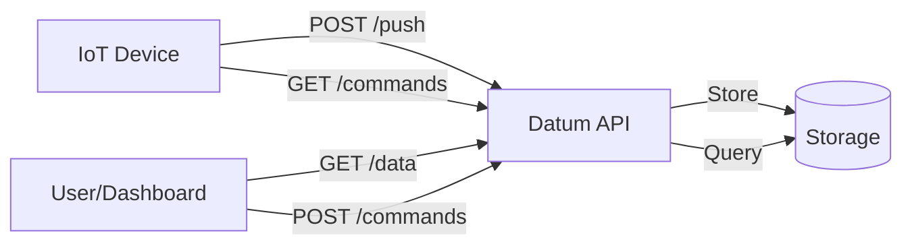

# Quick Start Guide

Get your first IoT device sending data to Datum in under 10 minutes.

## Prerequisites

- Docker and Docker Compose installed
- A device (ESP32, Raspberry Pi, or any HTTP-capable device)
- Basic understanding of REST APIs

## Step 1: Start the Server

```bash
# Clone the repository
git clone https://github.com/yourusername/datum-server.git
cd datum-server

# Start with Docker Compose
docker-compose up -d
```

The server starts at `http://localhost:8080`.

## Step 2: Complete Initial Setup

On first run, you'll need to create an admin user:

```bash
curl -X POST http://localhost:8080/system/setup \
  -H "Content-Type: application/json" \
  -d '{
    "admin_email": "admin@example.com",
    "admin_password": "your-secure-password"
  }'
```

Response:
```json
{
  "message": "System initialized successfully",
  "admin_id": "usr_abc123"
}
```

## Step 3: Login and Get Token

```bash
curl -X POST http://localhost:8080/auth/login \
  -H "Content-Type: application/json" \
  -d '{
    "email": "admin@example.com",
    "password": "your-secure-password"
  }'
```

Response:
```json
{
  "token": "eyJhbGciOiJIUzI1NiIs...",
  "user_id": "usr_abc123"
}
```

Save this token - you'll need it for authenticated requests.

## Step 4: Create a Device

```bash
export TOKEN="eyJhbGciOiJIUzI1NiIs..."

curl -X POST http://localhost:8080/devices \
  -H "Authorization: Bearer $TOKEN" \
  -H "Content-Type: application/json" \
  -d '{
    "name": "My First Sensor",
    "description": "Temperature sensor in the living room"
  }'
```

Response:
```json
{
  "device_id": "dev_xyz789",
  "name": "My First Sensor",
  "api_key": "dk_a1b2c3d4e5f6...",
  "created_at": "2024-01-15T10:30:00Z"
}
```

**Important:** Save the `api_key` - you'll use it on your device.

## Step 5: Send Data from Your Device

### Option A: Using curl (for testing)

```bash
export API_KEY="dk_a1b2c3d4e5f6..."
export DEVICE_ID="dev_xyz789"

curl -X POST "http://localhost:8080/device/$DEVICE_ID/push" \
  -H "Authorization: Bearer $API_KEY" \
  -H "Content-Type: application/json" \
  -d '{
    "temperature": 22.5,
    "humidity": 45,
    "battery": 3.7
  }'
```

Response:
```json
{
  "status": "ok",
  "timestamp": "2024-01-15T10:35:00Z",
  "commands_pending": 0
}
```

### Option B: ESP32/Arduino

```cpp
#include <WiFi.h>
#include <HTTPClient.h>

const char* WIFI_SSID = "YourWiFi";
const char* WIFI_PASS = "YourPassword";
const char* API_KEY = "dk_a1b2c3d4e5f6...";
const char* DEVICE_ID = "dev_xyz789";
const char* SERVER = "http://your-server:8080";

void setup() {
    Serial.begin(115200);
    WiFi.begin(WIFI_SSID, WIFI_PASS);
    while (WiFi.status() != WL_CONNECTED) delay(500);
    Serial.println("WiFi connected");
}

void loop() {
    if (WiFi.status() == WL_CONNECTED) {
        HTTPClient http;
        String url = String(SERVER) + "/device/" + DEVICE_ID + "/push";
        
        http.begin(url);
        http.addHeader("Authorization", String("Bearer ") + API_KEY);
        http.addHeader("Content-Type", "application/json");
        
        String payload = "{\"temperature\": 22.5, \"humidity\": 45}";
        int code = http.POST(payload);
        
        if (code > 0) {
            Serial.printf("Response: %d\n", code);
        }
        http.end();
    }
    delay(60000); // Send every minute
}
```

### Option C: Python/MicroPython

```python
import urequests  # MicroPython
# import requests as urequests  # Standard Python

API_KEY = "dk_a1b2c3d4e5f6..."
DEVICE_ID = "dev_xyz789"
SERVER = "http://your-server:8080"

def send_data(temperature, humidity):
    response = urequests.post(
        f"{SERVER}/device/{DEVICE_ID}/push",
        headers={
            "Authorization": f"Bearer {API_KEY}",
            "Content-Type": "application/json"
        },
        json={
            "temperature": temperature,
            "humidity": humidity
        }
    )
    return response.status_code == 200
```

## Step 6: Query Your Data

### Get Latest Reading

```bash
curl -H "Authorization: Bearer $TOKEN" \
  "http://localhost:8080/data/$DEVICE_ID"
```

Response:
```json
{
  "device_id": "dev_xyz789",
  "timestamp": "2024-01-15T10:35:00Z",
  "payload": {
    "temperature": 22.5,
    "humidity": 45,
    "battery": 3.7
  }
}
```

### Get Historical Data

```bash
# Last 24 hours, hourly intervals
curl -H "Authorization: Bearer $TOKEN" \
  "http://localhost:8080/data/$DEVICE_ID/history?period=24h&interval=1h"
```

Response:
```json
{
  "device_id": "dev_xyz789",
  "start": "2024-01-14T10:35:00Z",
  "end": "2024-01-15T10:35:00Z",
  "interval": "1h",
  "data": [
    {
      "timestamp": "2024-01-14T11:00:00Z",
      "payload": {"temperature": 21.8, "humidity": 48}
    },
    {
      "timestamp": "2024-01-14T12:00:00Z",
      "payload": {"temperature": 22.1, "humidity": 46}
    }
  ]
}
```

## Step 7: Send Commands to Device

### Queue a Command

```bash
curl -X POST "http://localhost:8080/devices/$DEVICE_ID/commands" \
  -H "Authorization: Bearer $TOKEN" \
  -H "Content-Type: application/json" \
  -d '{
    "action": "set_interval",
    "payload": {"seconds": 30}
  }'
```

### Poll Commands on Device

```bash
# Device polls for commands
curl -H "Authorization: Bearer $API_KEY" \
  "http://localhost:8080/device/$DEVICE_ID/commands/poll"
```

### Acknowledge Command

```bash
export CMD_ID="cmd_abc123"

curl -X POST "http://localhost:8080/device/$DEVICE_ID/commands/$CMD_ID/ack" \
  -H "Authorization: Bearer $API_KEY" \
  -H "Content-Type: application/json" \
  -d '{"status": "success"}'
```

## Step 8: Access the Dashboard

Open your browser and navigate to:

```
http://localhost:8050
```

Login with your admin credentials to see:
- Device overview
- Real-time data visualization
- Command management
- System configuration

## Next Steps

- 📖 [API Reference](../reference/API.md) - Complete endpoint documentation
- 🔧 [Use Cases](USE_CASES.md) - Real-world application examples
- 🚀 [Deployment Guide](../guides/DEPLOYMENT.md) - Production deployment
- 🔒 [Security Guide](../guides/SECURITY.md) - Security best practices

## Common Issues

### Device Can't Connect

1. Check firewall allows port 8080
2. Verify API key is correct
3. Ensure device ID matches
4. Check server logs: `docker-compose logs backend`

### Data Not Showing

1. Verify data was sent (check HTTP response code)
2. Check device ownership (user must own device)
3. Verify token hasn't expired

### High Latency

1. Use `/push` endpoint (device-initiated)
2. Reduce payload size
3. Check network connection
4. Consider using SSE for real-time needs

## Architecture Overview



Your IoT platform is now ready! Start collecting data from your devices.
