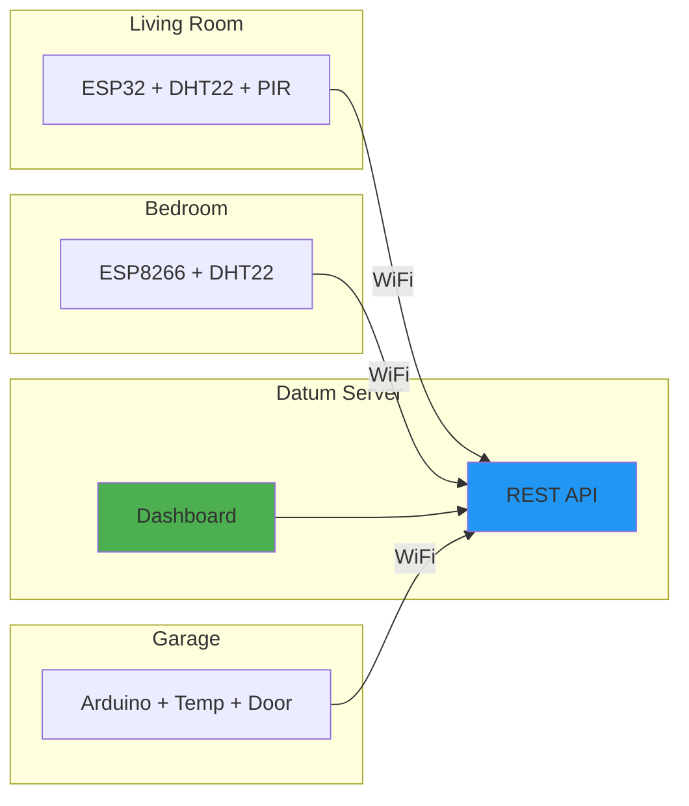
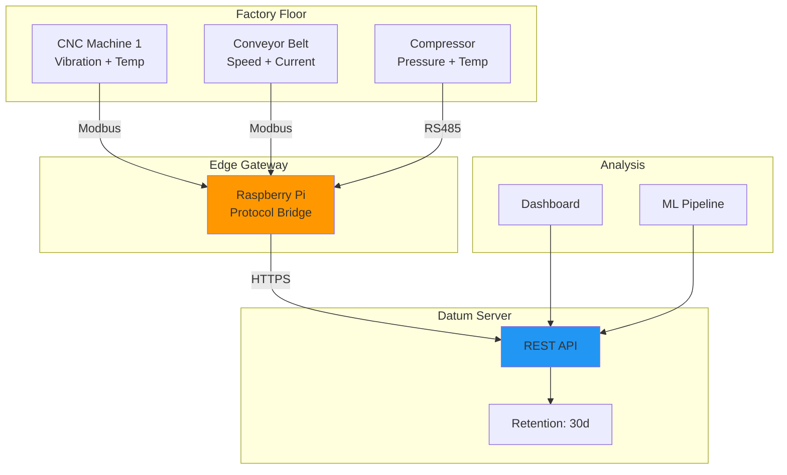
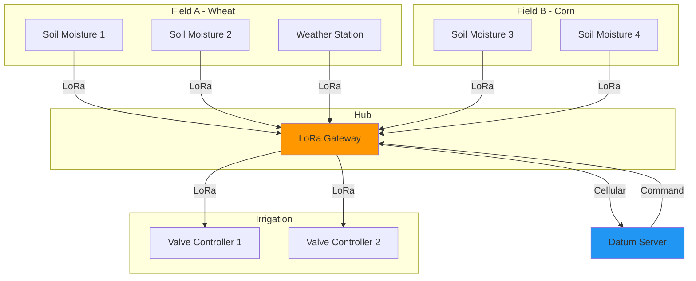
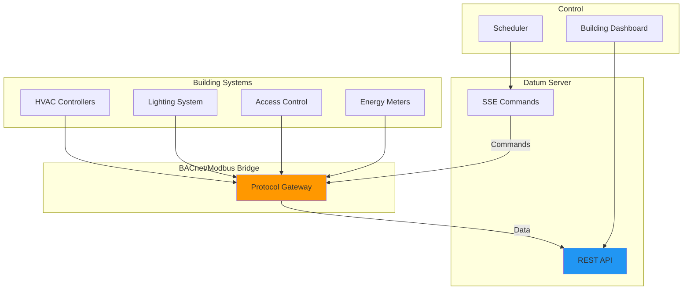

# Use Cases

This guide provides practical examples and use cases for the Datum IoT Platform, helping you understand how to apply it to real-world scenarios.

## Table of Contents

1. [Smart Home Monitoring](#smart-home-monitoring)
2. [Environmental Monitoring Station](#environmental-monitoring-station)
3. [Industrial Equipment Monitoring](#industrial-equipment-monitoring)
4. [Agricultural IoT](#agricultural-iot)
5. [Fleet Management](#fleet-management)
6. [Building Automation](#building-automation)

---

## Smart Home Monitoring

### Overview

Monitor temperature, humidity, light levels, and motion across multiple rooms in your home.

### Architecture



### Data Schema

```json
{
  "device_id": "living-room-sensor",
  "payload": {
    "temperature": 22.5,
    "humidity": 45,
    "motion_detected": false,
    "light_level": 350
  }
}
```

### Example Arduino Code

```cpp
#include <WiFi.h>
#include <HTTPClient.h>
#include <DHT.h>
#include <ArduinoJson.h>

#define DHT_PIN 4
#define DHT_TYPE DHT22
#define PIR_PIN 15

DHT dht(DHT_PIN, DHT_TYPE);
const char* API_KEY = "your_device_api_key";
const char* SERVER = "http://your-server:8000";

void sendData() {
    StaticJsonDocument<256> doc;
    doc["temperature"] = dht.readTemperature();
    doc["humidity"] = dht.readHumidity();
    doc["motion_detected"] = digitalRead(PIR_PIN) == HIGH;
    doc["light_level"] = analogRead(34);
    
    String payload;
    serializeJson(doc, payload);
    
    HTTPClient http;
    http.begin(String(SERVER) + "/dev/living-room-sensor/data");
    http.addHeader("Authorization", "Bearer " + String(API_KEY));
    http.addHeader("Content-Type", "application/json");
    
    int code = http.POST(payload);
    // Handle response...
    http.end();
}
```

### Dashboard Queries

```bash
# Get current readings
curl -H "Authorization: Bearer $TOKEN" \
  "$SERVER/dev/living-room-sensor/data"

# Get 24-hour history
curl -H "Authorization: Bearer $TOKEN" \
  "$SERVER/dev/living-room-sensor/data/history?period=24h&interval=1h"

# Get all home sensors
curl -H "Authorization: Bearer $TOKEN" \
  "$SERVER/dev?owner=$USER_ID"
```

### Automation Example

Use SSE to trigger automation when motion is detected:

```javascript
const eventSource = new EventSource(
  `${SERVER}/dev/living-room-sensor/cmd/stream`,
  { headers: { 'Authorization': `Bearer ${API_KEY}` } }
);

eventSource.onmessage = (event) => {
  const data = JSON.parse(event.data);
  if (data.motion_detected && isNightTime()) {
    // Trigger lights via another command
    sendCommand('smart-light', { action: 'on', brightness: 50 });
  }
};
```

---

## Environmental Monitoring Station

### Overview

Deploy a weather station that monitors atmospheric conditions for local climate tracking.

### Sensors

| Sensor | Measurement | Range |
|--------|-------------|-------|
| BME280 | Temperature | -40°C to +85°C |
| BME280 | Humidity | 0-100% RH |
| BME280 | Pressure | 300-1100 hPa |
| BH1750 | Light | 1-65535 lux |
| Rain Gauge | Precipitation | 0-200 mm/hr |
| Anemometer | Wind Speed | 0-60 m/s |
| Wind Vane | Wind Direction | 0-360° |

### Data Schema

```json
{
  "device_id": "weather-station-01",
  "payload": {
    "temperature": 18.3,
    "humidity": 65,
    "pressure": 1013.25,
    "light_lux": 45000,
    "rain_mm": 0.0,
    "wind_speed_ms": 3.2,
    "wind_direction": 225,
    "battery_voltage": 4.12,
    "solar_voltage": 5.8
  }
}
```

### Power Management

For solar-powered stations, implement deep sleep:

```cpp
#include <esp_sleep.h>

#define SLEEP_DURATION_MINUTES 15

void setup() {
    // Read sensors
    readAllSensors();
    
    // Send data
    sendToServer();
    
    // Enter deep sleep
    esp_sleep_enable_timer_wakeup(SLEEP_DURATION_MINUTES * 60 * 1000000ULL);
    esp_deep_sleep_start();
}

void loop() {
    // Never reached
}
```

### Historical Analysis

```bash
# Get monthly precipitation data
curl -H "Authorization: Bearer $TOKEN" \
  "$SERVER/dev/weather-station-01/data/history?start=2024-01-01&end=2024-01-31&aggregation=sum&fields=rain_mm"

# Get temperature trends
curl -H "Authorization: Bearer $TOKEN" \
  "$SERVER/dev/weather-station-01/data/history?period=7d&interval=1h&fields=temperature"
```

---

## Industrial Equipment Monitoring

### Overview

Monitor industrial machinery for predictive maintenance and operational efficiency.

### Architecture



### Data Schema

```json
{
  "device_id": "cnc-machine-001",
  "payload": {
    "spindle_rpm": 12000,
    "spindle_load": 45,
    "vibration_x": 0.15,
    "vibration_y": 0.12,
    "vibration_z": 0.08,
    "coolant_temp": 28.5,
    "coolant_level": 85,
    "power_consumption_kw": 8.2,
    "operating_hours": 4523,
    "alarm_code": 0
  }
}
```

### Alert Thresholds

Configure commands to alert on anomalies:

```bash
# Send alert command when vibration exceeds threshold
curl -X POST -H "Authorization: Bearer $TOKEN" \
  -H "Content-Type: application/json" \
  -d '{"action": "alert", "payload": {"type": "vibration_high", "threshold": 0.5}}' \
  "$SERVER/dev/cnc-machine-001/cmd"
```

### Edge Gateway (Python)

```python
import minimalmodbus
import requests
import time

# Modbus setup
instrument = minimalmodbus.Instrument('/dev/ttyUSB0', 1)
instrument.serial.baudrate = 9600

API_KEY = "device_api_key"
SERVER = "https://your-server:8000"

def read_and_send():
    data = {
        "spindle_rpm": instrument.read_register(0, 0),
        "spindle_load": instrument.read_register(1, 0),
        "vibration_x": instrument.read_float(10),
        "vibration_y": instrument.read_float(12),
        "vibration_z": instrument.read_float(14),
    }
    
    response = requests.post(
        f"{SERVER}/dev/cnc-machine-001/data",
        headers={"Authorization": f"Bearer {API_KEY}"},
        json=data
    )
    return response.status_code == 200

while True:
    read_and_send()
    time.sleep(1)  # High-frequency monitoring
```

---

## Agricultural IoT

### Overview

Monitor soil conditions, irrigation systems, and crop health across multiple fields.

### Sensor Network



### Data Schema

```json
{
  "device_id": "field-a-sensor-1",
  "payload": {
    "soil_moisture_percent": 35,
    "soil_temperature": 18.5,
    "soil_ec": 1.2,
    "soil_ph": 6.8,
    "air_temperature": 24.0,
    "air_humidity": 55,
    "leaf_wetness": false,
    "battery_percent": 78
  }
}
```

### Irrigation Control

```bash
# Check soil moisture
MOISTURE=$(curl -s -H "Authorization: Bearer $TOKEN" \
  "$SERVER/dev/field-a-sensor-1/data" | jq '.payload.soil_moisture_percent')

# Trigger irrigation if needed
if [ "$MOISTURE" -lt 30 ]; then
  curl -X POST -H "Authorization: Bearer $TOKEN" \
    -H "Content-Type: application/json" \
    -d '{"action": "irrigate", "payload": {"duration_minutes": 30}}' \
    "$SERVER/dev/valve-controller-1/cmd"
fi
```

---

## Fleet Management

### Overview

Track vehicle locations, driver behavior, and fuel consumption across a fleet.

### Data Schema

```json
{
  "device_id": "truck-142",
  "payload": {
    "latitude": 41.0082,
    "longitude": 28.9784,
    "speed_kmh": 65,
    "heading": 180,
    "altitude": 45,
    "fuel_level_percent": 72,
    "engine_rpm": 2200,
    "coolant_temp": 88,
    "odometer_km": 145678,
    "ignition_on": true,
    "harsh_braking": false,
    "harsh_acceleration": false
  }
}
```

### Geofencing

Use commands to set up geofence alerts:

```bash
# Define warehouse geofence
curl -X POST -H "Authorization: Bearer $TOKEN" \
  -H "Content-Type: application/json" \
  -d '{
    "action": "set_geofence",
    "payload": {
      "id": "warehouse-1",
      "center_lat": 41.0082,
      "center_lng": 28.9784,
      "radius_meters": 500,
      "alert_on": "exit"
    }
  }' \
  "$SERVER/dev/truck-142/cmd"
```

### Fleet Dashboard Query

```bash
# Get vehicle position
curl -H "Authorization: Bearer $TOKEN" \
  "$SERVER/dev/truck-142/data"

# Get trip history for a specific truck
curl -H "Authorization: Bearer $TOKEN" \
  "$SERVER/dev/truck-142/data/history?start=2024-01-15T08:00:00Z&end=2024-01-15T18:00:00Z"
```

---

## Building Automation

### Overview

Manage HVAC, lighting, and access control in a commercial building.

### System Architecture



### Zone Data Schema

```json
{
  "device_id": "floor-3-zone-a",
  "payload": {
    "temperature_setpoint": 22,
    "temperature_actual": 21.5,
    "humidity_percent": 45,
    "co2_ppm": 650,
    "occupancy_count": 12,
    "hvac_mode": "cooling",
    "hvac_power_percent": 65,
    "lighting_level_percent": 80,
    "window_blinds_percent": 50
  }
}
```

### Scheduled Control

```bash
# Set night mode at 7 PM
curl -X POST -H "Authorization: Bearer $TOKEN" \
  -H "Content-Type: application/json" \
  -d '{
    "action": "set_mode",
    "payload": {
      "mode": "night",
      "temperature_setpoint": 18,
      "lighting_level": 10
    }
  }' \
  "$SERVER/dev/floor-3-zone-a/cmd"
```

### Energy Monitoring

```bash
# Get daily energy consumption
curl -H "Authorization: Bearer $TOKEN" \
  "$SERVER/dev/main-meter/data/history?period=24h&interval=1h&aggregation=sum&fields=kwh"

# Compare zones
for zone in zone-a zone-b zone-c; do
  echo "Floor 3 $zone:"
  curl -s -H "Authorization: Bearer $TOKEN" \
    "$SERVER/dev/floor-3-$zone/data/history?period=7d&aggregation=avg" | \
    jq '.data[].payload.hvac_power_percent'
done
```

---

## Best Practices

### Data Optimization

1. **Batch readings** when possible to reduce network overhead
2. **Use appropriate intervals** - don't over-sample stable metrics
3. **Compress payloads** for low-bandwidth connections
4. **Implement local buffering** for unreliable connections

### Security

1. **Use unique API keys** per device
2. **Enable TLS/HTTPS** in production
3. **Implement rate limiting** appropriate to your use case
4. **Rotate API keys** periodically

### Reliability

1. **Handle network failures** gracefully with retries
2. **Buffer data locally** during outages
3. **Implement watchdog timers** on devices
4. **Monitor device health** via last-seen timestamps

### Scalability

1. **Use appropriate retention periods** to manage storage
2. **Aggregate historical data** for long-term analysis
3. **Consider partitioning** by device type or location
4. **Plan for horizontal scaling** if needed

---

## Related Documentation

- [API Reference](../reference/API.md)
- [Datum Examples Repo](https://github.com/datum-iot/examples)
- [Deployment Guide](../guides/DEPLOYMENT.md)
