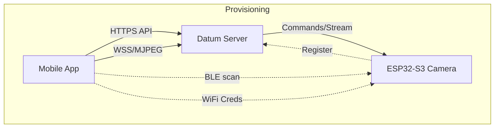

# Datum Camera App

The official mobile companion app for the Datum IoT Platform, designed to manage, provision, and view streams from ESP32-S3 Camera devices.

## 📱 Features

### 1. **Device Provisioning (BLE & WiFi)**
   - Automatically detects unprovisioned ESP32 devices via Bluetooth Low Energy (BLE).
   - Securely transfers WiFi credentials to the device.
   - Registers the device with the Datum Server and generates API keys.

### 2. **Real-time Streaming**
   - Low-latency MJPEG video streaming.
   - WebSocket-based binary streaming support.
   - Auto-reconnect and error handling.
   - **Fullscreen Mode**: Immersive landscape viewing.

### 3. **Video Recording & Gallery**
   - **Native Recording**: Records the MJPEG stream directly to MP4 using hardware encoding (`flutter_quick_video_encoder`).
   - **Zero FFmpeg Dependency**: Optimized for small APK size (~30MB) and high performance.
   - **In-App Gallery**:
     - View recorded videos and snapshots.
     - Auto-generated thumbnails.
     - Built-in video player.
     - "Share" and "Open Externally" options.

### 4. **Device Management**
   - "Toggle LED" control.
   - "Restart" command.
   - Delete device.

## 🏗 Architecture

The app communicates with both the ESP32 device (locally via BLE/WiFi) and the Datum Server (via HTTPS/WSS).



## 🚀 Getting Started

### Prerequisites
- Flutter SDK (3.x+)
- Android SDK (API 24+)
- A running Datum Server instance

### Installation

1. **Clone & Install Dependencies**
   ```bash
   git clone https://git.bezg.in/batterymanager/datum-server.git
   cd datum-server/examples/datum_camera_app
   flutter pub get
   ```

2. **Configuration**
   The app connects to the production server by default (`https://datum.bezg.in`).
   To change this, edit `lib/api_client.dart`:
   ```dart
   _dio.options.baseUrl = 'YOUR_SERVER_URL';
   ```

3. **Build & Run**
   ```bash
   # Run in debug mode
   flutter run

   # Build Release APK
   flutter build apk --release
   ```

## 🛠 Tech Stack

- **Framework**: Flutter (Dart)
- **State Management**: Provider
- **Networking**: Dio
- **Video Encoding**: `flutter_quick_video_encoder` (Native MediaCodec/AVFoundation)
- **Streaming**: `flutter_mjpeg`
- **BLE**: `flutter_blue_plus`
- **Provisioning**: `esp_provisioning`

## 📂 Project Structure

```
lib/
├── models/          # Data models (Device, WifiNetwork)
├── providers/       # State management (auth, device list)
├── screens/         # UI Screens
│   ├── login_screen.dart
│   ├── home_screen.dart
│   ├── provisioning_wizard.dart
│   ├── device_detail_screen.dart  # Stream & Controls
│   └── full_screen_stream.dart    # Landscape Stream & Recording
├── api_client.dart  # HTTP Client & API methods
└── main.dart        # Entry point
```

## ⚠️ Important Notes

- **Android 9+**: Uses `android:usesCleartextTraffic="true"` to support local HTTP servers.
- **Video Recording**: Requires `WRITE_EXTERNAL_STORAGE` permissions on older Android versions (handled automatically).

